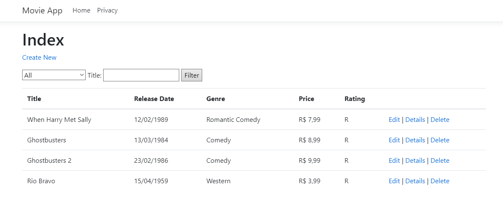

<h1 align="center">ASP.NET Core - MVCMovie</h1>

<h2 align="center">
    <a href="https://docs.microsoft.com/en-us/aspnet/core/tutorials/first-mvc-app/start-mvc?view=aspnetcore-5.0&tabs=visual-studio" target="_blank" style="color:black; text-decoration:none;"> 🔗 Tutorial ASP.NET Core MVC por Microsoft Docs</a>
</h2>

🚀 Aplicativo de acordo com os padrões MVC, que gerencia e exibe dados de filmes. O aplicativo é resultado do Tutorial da Microsoft Docs

   

## :hammer: Tecnologias e Ferramentas Utilizadas

As seguintes ferramentas foram usadas na construção do projeto:

- **ASP.NET CORE**
- **C#**
- **SQLite**
- **HTML**
- **CSS**
- **Bootstrap** - *version 4.3.1*

## :busts_in_silhouette: Contribuição

- [Cauã Rodrigues](https://github.com/CauaRodrigues)
- [Gabriel Mariano](https://github.com/Gabriel-MarianoJ)
- [Gabriel dos Santos](https://github.com/GabrielGSF)
- [João Fernando](https://github.com/Joaocaetano1105)
- [João Ozorio](https://github.com/odrelvic)

### :link: [Link do Projeto]()

